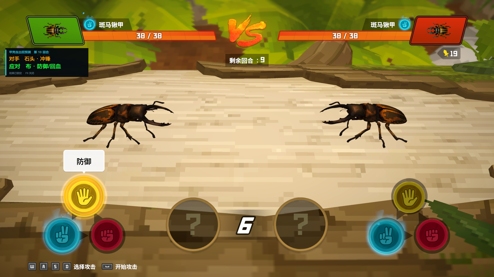

# 甲虫大作战预测 Mod：功能介绍与使用教程

[返回仓库首页](../README.md) · [查看独立安装教程](INSTALL_BEETLE_BATTLE_PREDICTOR.zh-CN.md)

- 当前版本：`v1.0.8`
- 技术名称：`BeetleBattlePredictor`

## 这个 Mod 做什么

本 Mod 专门用于丛林 DLC 的“甲虫大作战”小游戏。开启后，它会在玩家选择动作时显示对手即将使用的招式，并给出必胜的克制动作。

它不会改变探索地图中的甲虫或蝴蝶刷新。需要修改昆虫刷新时，请使用另一个独立 Mod：[未收集昆虫刷新 Mod](UNCOLLECTED_INSECT_SPAWNER.zh-CN.md)。

## 使用方法

- 每次启动游戏时，预测功能默认关闭。
- 进入甲虫大作战后按 `F8` 开启，屏幕会短暂显示“甲壳虫预测：已开启”。
- 再按一次 `F8` 即可关闭。
- 部分笔记本电脑需要按 `Fn+F8`。

## 招式对应关系

| 对手动作 | 猜拳含义 | 推荐应对 |
|---|---|---|
| Defense（防御/回血） | 布 | HornAttack（角攻击/剪刀） |
| HornAttack（角攻击） | 剪刀 | Rush（冲锋/石头） |
| Rush（冲锋） | 石头 | Defense（防御/回血/布） |

## 影响范围

Mod 会提前生成并锁定本回合敌方甲虫的动作，以便在选择阶段显示预测结果。它不修改血量、伤害、回合结算或存档。

## 安装

本 Mod 有自己独立的安装包和教程：

- [甲虫大作战预测 Mod 详细安装教程](INSTALL_BEETLE_BATTLE_PREDICTOR.zh-CN.md)
- [下载 BeetleBattlePredictor v1.0.8](https://raw.githubusercontent.com/anmuxixixi/DaveTheDiver_Mod/main/artifacts/BeetleBattlePredictor-v1.0.8.zip)

不要下载名称为 `UncollectedBeetleSpawner` 的安装包；那是负责探索地图昆虫刷新的另一个 Mod。
